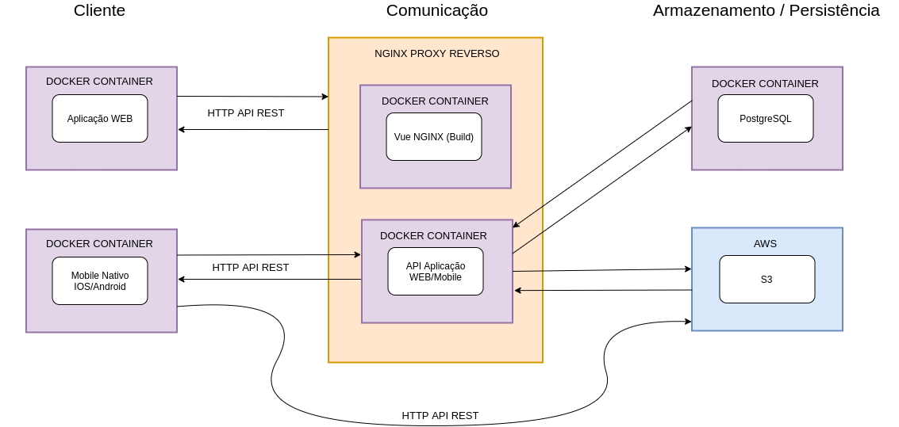

# MetodologiaCientifica

### Projeto Inclusão de Testes na API que Alimenta o aplicativo do Vanguarda Reporter
### Nome: Pedro Henrique Cerqueira Fernandes
### RA: 1460481621067
### Professor: GIULIANO ARAUJO BERTOTI

#### PROBLEMA: 

A não existência de testes automatizados na api do aplicativo do Vanguarda Reporter  

#### MOTIVAÇÃO: 

A falta de testes durante o desenvolvimento da api tem causado atraso no desenvolvimento e retrabalho ao revisar parte da aplicação

#### PROPOSTA DE SOLUÇÃO:

Implementar testes automatizados unitários e de integração do que já foi desenvolvido e integrar testes durante o desenvolvimento das funcionalidades que faltam no projeto

#### Esboço TG

#### INTRODUÇÃO

É cada vez mais importante para uma emissora de televisão regional, aproximar o público e mostrar conteúdo direcionado, a afiliada a rede Globo no vale do Paraíba, Vanguarda, possui o aplicativo Vanguarda Repórter, nele é possível o telespectador enviar notícias locais participar de concursos culturais e enquetes da emissora, é uma forma prática da equipe de jornalismo receber informações que podem se tornar notícias importantes nos jornais que ela apresenta. A Vanguarda possui um site interno e com ele a equipe de jornalismo recebe e analisa as notícias enviadas, envia mensagens para os telespectadores e cria os concursos e enquetes. O aplicativo e o site em questão são atualmente alimentados por uma API escrita em Ruby com o Framework Ruby on Rails, a empresa Necto Systems foi contratada para atualizar o aplicativo, que irá receber novas funcionalidades, alterar a API para Python com o Framework Django, inserir análises de dados com inteligência artificial, que ajudará a equipe de jornalismo nas verificações das notícias enviadas em um novo site interno. Durante o desenvolvimento de um projeto de software mesmo com planejamento, comportamentos inesperados podem acontecer. Verificar e revisar constantemente as funcionalidades não é só uma forma antiquada de desenvolvimento como improdutivo também. A implantação de testes automatizados é a solução para um desenvolvimento eficiente.

Seguem algumas vantagens do uso de testes no desenvolvimento

##### ● Tempo

Mesmo que no início pareça que está se gastando mais tempo, mas na verdade se está economizando, mais pra frente com a medida que o projeto fica mais complexo.
##### ● Custo

Segundo o livro Engenharia de Software de Pressman o custo de implementar o teste no projeto pode ser 100 vezes menor comparado aos ter que encontrar e reparar falhas.
##### ● Qualidade

Para garantir a qualidade de qualquer produto testes são necessários isso desde sistemas simples até os mais complexos.

#### Definição do problema

Conforme o projeto aumentava de tamanho e complexibilidade, sua manutenção e continuidade foi se tornando mais lenta, já que passava a surgir cada vez mais retrabalho por métodos que vinham a entrar em conflitos com outros, já implementados, fazendo com que sempre fosse preciso dar um passo para trás.

#### Objetivo

A motivação deste trabalho é garantir a qualidade e diminuir futuros gastos e retrabalhos por meio da implementação de testes de software

#### DESENVOLVIMENTO
##### Arquitetura

A arquitetura geral do sistema pode ser observada na imagem a seguir, sendo que:

##### ● Cliente
  – usuários que acessam as aplicações:o Aplicação WEB​ – Vanguarda Admin.o Mobile Nativo​ – Aplicativo Vanguarda Repórter.

##### ● Comunicação

Conectivo entre o Cliente e o Armazenamento, onde ocorre o controle de rotas e o processamento das regras de negócio. o NGINX Proxy Reverso – Mediador entre aplicações e servidores. o Vue NGINX​ – Lugar em que é feito o build dos arquivos estáticos. o API Aplicação WEB/Mobile – API REST respo
##### ● Armazenamento / Persistência
Ambientes em que são armazenados os dados do sistema, banco de dados. o PostgreSQL – Banco de dados. o AWS – Responsável por armazenar as mídias enviadas pelo aplicativo mobile.

Diagrama 1 –Arquitetura do sistema

#### Modelo de Dados

A próxima figura apresenta o modelo de dados do sistema, uma representação ilustrativa de como os dados interagem dentro do banco de dados PostgreSQL, contendo as seguintes tabelas:

mobile_registers – forma antiga de armazenamento dos usuários cadastrados no
aplicativo (versões anteriores).
users – usuários cadastrados no aplicativo.
feeds – possíveis notícias enviadas pelos usuários do aplicativo VR.
assets – hashs das notícias enviadas para verificação no repositório da AWS..
comments – comentários dos administradores do site interno nas notícias exibidas.
feeds_shows – exibição das notícias e os respectivos pontos.
programs – programas da grade de notícias da vanguarda.
admins – usuários do sistema site interno(funcionários da Vanguarda).
groups – grupos de usuários do site interno.
access_rules – regras de acesso dos usuários do site interno.
access_rules_groups – regras de acesso por grupo do site interno.
logs – log dos usuários do site interno.
competitions – concursos criados para os usuários do aplicativo participarem.
polls – enquetes para os usuários do aplicativo.
poll_alternatives – alternativas de uma enquete específica.
poll_answers – respostas das enquetes dadas pelos usuários do aplicativo.
messages – mensagens dos usuários do aplicativo enviadas aos usuários do site
interno como notificações.
tokens - tokens para acesso via JWT.

Diagrama 2 –Banco de Dados

#### Detalhes

Está sendo utilizado o Coverage para analisar a quantidade de código testado,
inicialmente para cobrir as funcionalidades principais da API tanto o que alimenta o aplicativo
quanto o site interno, conforme a imagem abaixo até o momento 78% do código atual passa
pelos testes.

Figura 1 – Cobertura Coverage

Como o projeto já estava iniciado, decidimos começar com os testes de saídas de
alguns endpoints, focando de forma inicial em testes funcionais.

##### Seguem alguns exemplos desses testes funcionais:

##### Criação de um novo usuário do aplicativo:

Figura 2 –Setup classe de teste do usuário do aplicativo

Figura 3 – Teste de criação de um novo usuário do aplicativo

Figura 4 – Teste de criação de usuário do aplicativo já existente no banco

##### Criação e visualização de um novo usuário do site interno:

Figura 5 – Setup classe de teste do usuário do aplicativo

Figura 6 – Teste de criação de usuário do site interno.

Figura 7 – Teste de criação de usuário do site interno já existente no banco

Figura 8 – Teste de visualização de usuário do site interno ativo.

Figura 9 – Teste de visualização de usuário do site interno inativo.

#### RESULTADOS E DISCUSSÃO

O desenvolvimento da API apresentou grande melhora devido a implantação dos testes
tanto na qualidade do código, agora orientado a testes, quanto na velocidade de
desenvolvimento, já que agora a cada nova funcionalidade desenvolvida testes verificam se as
funcionalidades já existentes não deixam de funcionar, com isso o custo e o tempo final do
projeto serão menores, satisfazendo tanto o cliente final quanto o time de desenvolvimento do
mobile e o time de front-end do site interno da empresa.

